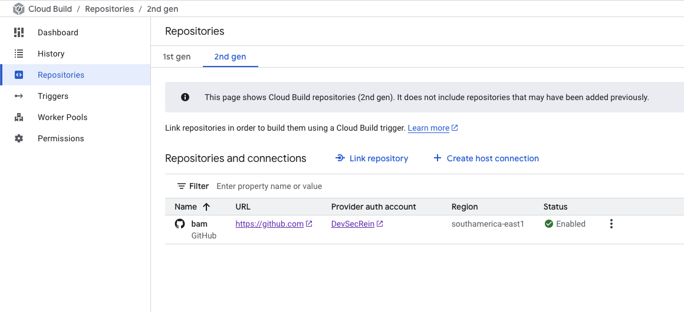

# Create a Cloud Build Trigger and manage traffic between deployments in Terraform

The purpose of this excercise is as stated above. And to this you we will start by forking [aaron-dm-mcdonald's cloud-run-ex repo](https://github.com/aaron-dm-mcdonald/cloud-run-ex) but instead of following the instructions, we complete the entire thing through terraform.

First thing needed is create a connection from your github account to your gcp account. To do so, go to Cloud Build Repositories > 2nd Gen and click Link Repository. Creat the connection but do not give it the same name as the name you want to use for your project.

Next rename the "renamethisfile.yaml" file included in this repo to "cloudbuild.yaml" and push it into the "cloud-run-ex" repo root folder. This file will give the instructions to build the image in Cloud Build.

After the yaml file is pushed, WITH THE CLOUD RUN SERVICE FILE COMMENTED OUT, terraform apply.

